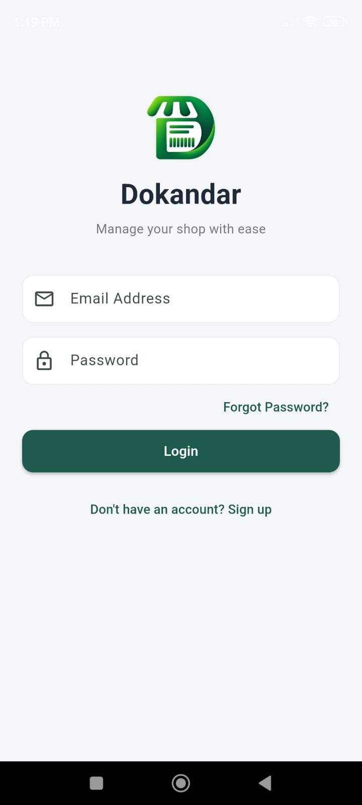
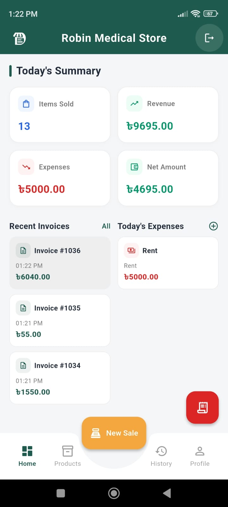
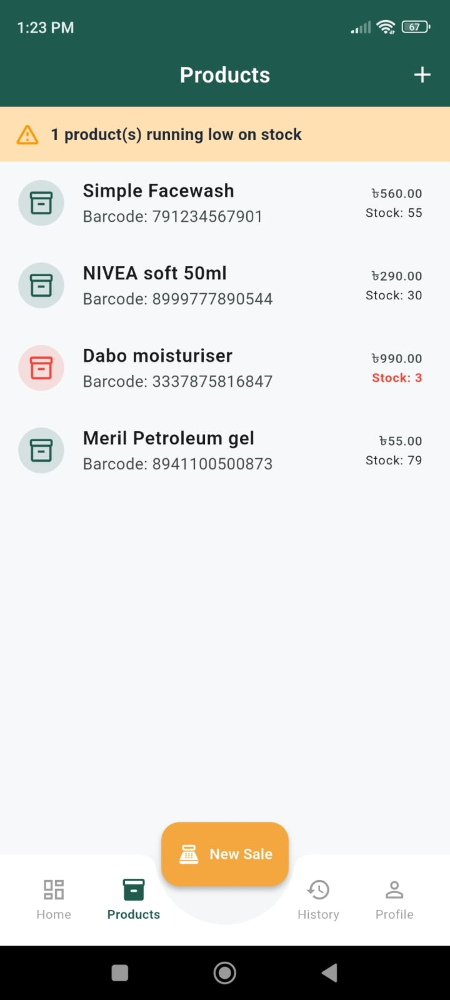
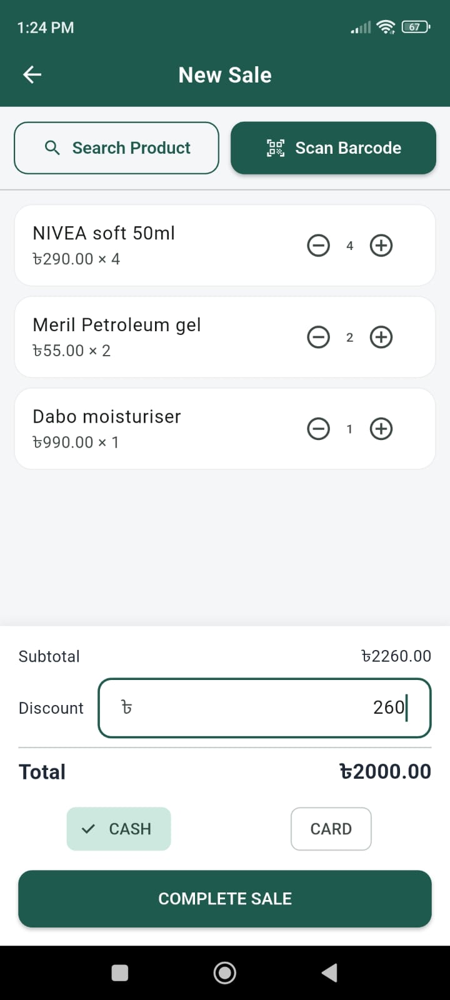
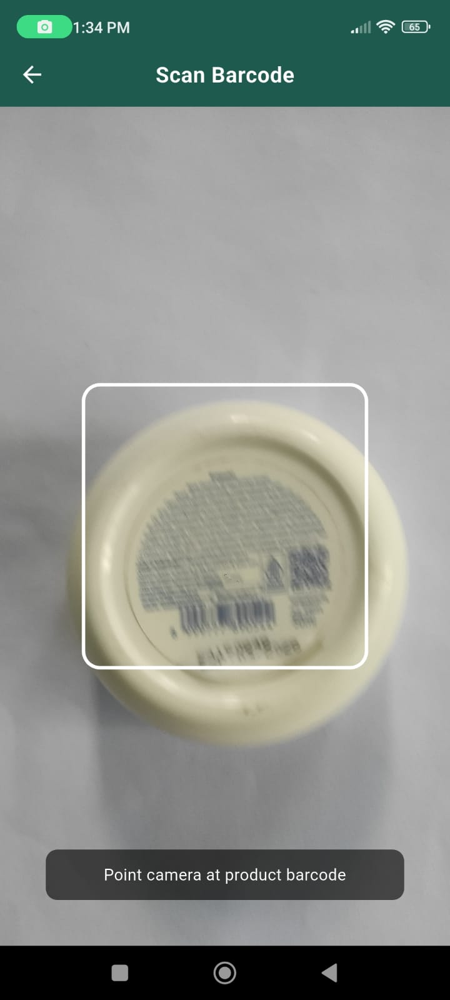
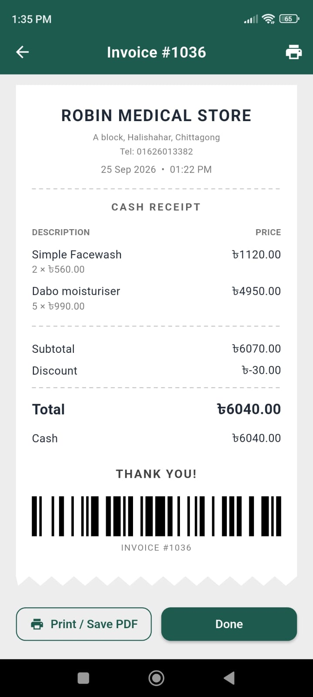
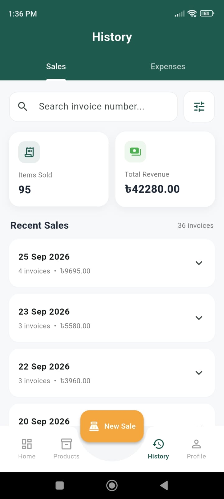
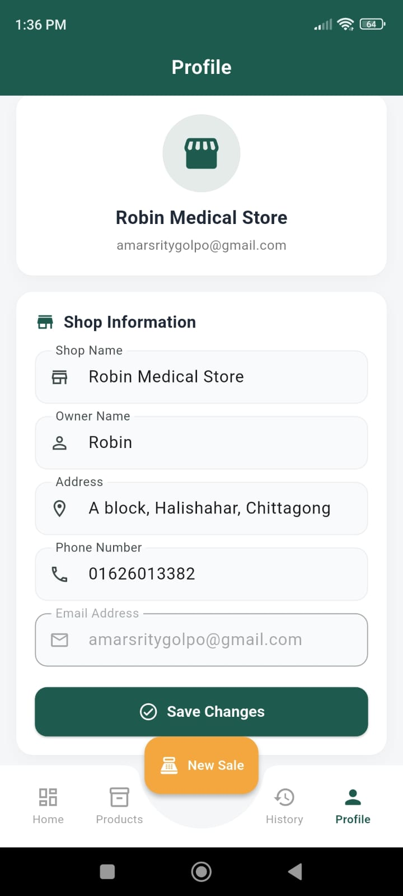

# 🏪 Dokandar

**Dokandar** is a mobile shop management application built with Flutter and Firebase, designed for small and medium business owners to digitize their daily operations — tracking sales, managing inventory, monitoring expenses, and generating digital receipts, all from their smartphone.


---

## 📱 Overview

Small shop owners often manage their entire business using paper notebooks — tracking daily sales, expenses, and stock manually. **Dokandar** solves this by providing a simple, mobile-first point-of-sale (POS) and business management system that works even without a stable internet connection.

---

## ✨ Key Features

### Authentication & Security
- Email-based sign up and login (Firebase Authentication)
- Mandatory email verification before app access
- Password reset via email
- Secure password change with re-authentication
- Full account and data deletion

### Shop Profile
- Editable shop name, owner name, address, and phone number
- Profile information reflected on generated receipts

### Product & Inventory Management
- Add, edit, and delete products
- Barcode-linked product records
- Real-time stock tracking with automatic deduction on sale
- Low-stock warning alerts

### Point of Sale (POS)
- Barcode scanning (`mobile_scanner`) to add products to cart
- Product search as an alternative to scanning
- Adjustable quantities, discounts, and payment method selection (Cash/Card)
- Sequential invoice numbering
- Automatic inventory deduction after each completed sale

### Digital Receipts
- Auto-generated, professionally styled receipts (torn-paper design)
- Shop details, itemized product list, totals, and barcode
- PDF export for printing or sharing (80mm thermal receipt format)

### Dashboard & Reporting
- Real-time daily summary — items sold, revenue, expenses, and net profit
- Complete sales history (searchable, filterable by date)
- Complete expense history with categorized tracking

### Offline Support
- Sales, product updates, and expense entries remain available during temporary network interruptions
- Firestore's local cache keeps the app responsive without a live connection
- Pending changes automatically synchronize with the server once connectivity is restored

### Modern UI/UX
- Bottom navigation with dedicated tabs: Home, Products, History, Profile
- Floating action button for quick sale entry
- Clean, consistent Material Design 3 interface

---

## 🛠️ Tech Stack

| Category | Technology |
|---|---|
| Framework | Flutter (Dart) |
| Backend / Database | Firebase Cloud Firestore |
| Authentication | Firebase Authentication |
| Barcode Scanning | `mobile_scanner` |
| PDF Generation | `pdf`, `printing` |
| Barcode Rendering | `barcode_widget` |
| Date Formatting | `intl` |

---

## 🏗️ Architecture

```text
                     User
                      │
                      ▼
              Flutter Mobile UI
        (Screens, Widgets, Navigation)
                      │
                      ▼
               Services Layer
        (AuthService, FirestoreService)
                      │
        ┌─────────────┴─────────────┐
        ▼                           ▼
Firebase Authentication      Cloud Firestore
   (Login / Signup)                 │
                                     ▼
                          Shop Data (per user)
                     ┌───────┬───────┬─────────┐
                     ▼       ▼       ▼         ▼
                 Products  Invoices  Expenses  Profile
```

Each shop's data is isolated by the authenticated user's UID, so every business using the app only ever sees and modifies its own data.

---

## 📂 Project Structure

```
lib/
├── main.dart                     # App entry point
├── firebase_options.dart         # Firebase configuration (not committed)
│
├── models/                       # Data models
│   ├── product.dart
│   ├── invoice.dart
│   ├── expense.dart
│   └── cart_item.dart
│
├── services/                     # Firebase / Firestore service layer
│   ├── auth_service.dart
│   └── firestore_service.dart
│
├── screens/                      # All app screens
│   ├── login_screen.dart, signup_screen.dart, verify_email_screen.dart
│   ├── main_navigation_screen.dart, dashboard_screen.dart
│   ├── products_tab.dart, add_product_screen.dart, edit_product_screen.dart
│   ├── new_sale_screen.dart, barcode_scanner_screen.dart, receipt_screen.dart
│   ├── history_screen.dart, sales_history_screen.dart, expense_history_screen.dart
│   └── profile_screen.dart
│
├── widgets/                      # Reusable UI components
└── theme/                        # App-wide theming and colors
```

> Note: this reflects the actual project layout — folder names and files match the codebase.

---

## 🚀 Getting Started

### Prerequisites
- [Flutter SDK](https://flutter.dev/docs/get-started/install) (latest stable)
- A [Firebase](https://firebase.google.com/) project
- Android Studio or VS Code

### Setup

1. **Clone the repository**
   ```bash
   git clone https://github.com/robin-karmakar/dokandar.git
   cd dokandar
   ```

2. **Install dependencies**
   ```bash
   flutter pub get
   ```

3. **Configure Firebase**
   - Create a Firebase project at [console.firebase.google.com](https://console.firebase.google.com)
   - Enable **Authentication** (Email/Password) and **Cloud Firestore**
   - Install the FlutterFire CLI (one-time):
     ```bash
     dart pub global activate flutterfire_cli
     ```
   - Generate your own `firebase_options.dart` by connecting it to your Firebase project:
     ```bash
     flutterfire configure
     ```

4. **Run the app**
   ```bash
   flutter run
   ```

> **Note:** This repository does not include `firebase_options.dart` or any API keys — each developer must connect their own Firebase project.

---

## 📸 Screenshots

| Login | Dashboard | Products |
|---|---|---|
|  |  |  |

| New Sale / POS | Barcode Scanner | Receipt |
|---|---|---|
|  |  |  |

| Sales History | Profile |
|---|---|
|  |  |

---

## 🎯 Project Context

**Dokandar** is a Flutter-based shop management application designed to simplify daily business operations for small and medium-sized businesses.

The application provides essential tools for managing **sales, inventory, expenses, products, customer receipts, and business records** from a single mobile platform. It also supports **offline data access and automatic synchronization** to help maintain smooth operation during temporary network interruptions.

The project demonstrates the practical implementation of **Flutter, Firebase, POS workflows, inventory management, barcode scanning, offline data synchronization, and digital PDF receipt generation** in a real-world business application.

---

## 📄 License

This project is independently developed and owned by the author. The author reserves the right to use, modify, distribute, and maintain this project for any personal, commercial, educational, or other lawful purpose.

---

## 👤 Author

Developed by **Robin Karmakar**
Flutter Developer
[GitHub Profile](https://github.com/robin-karmakar)

